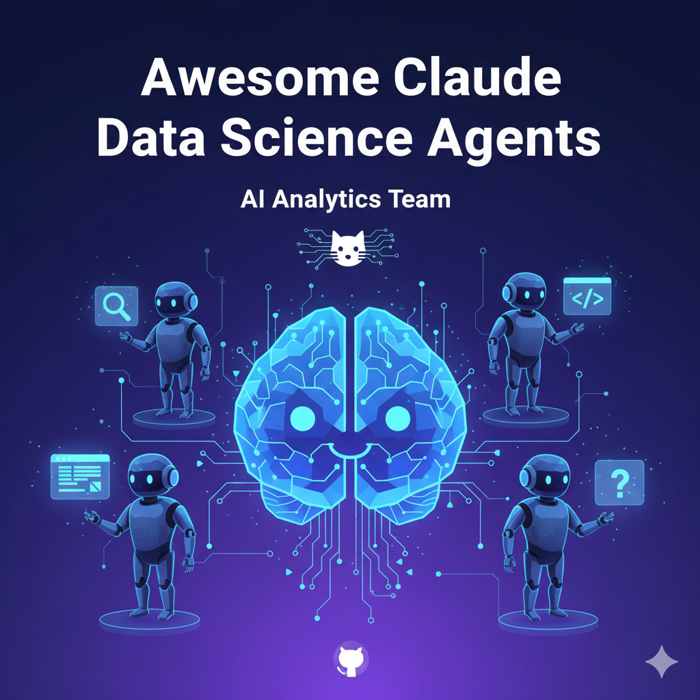

<p align="center">
  
</p>

# Awesome Claude Data Science Agents - AI Analytics Team 🚀

**Supercharge Claude Code with a specialized team of AI agents** for data analysis, machine learning, visualization, and data science workflows.

[](README.md)
[](README_CN.md)

[](https://github.com/StanleyChanH/awesome-claude-data-agents)
[](https://github.com/StanleyChanH/awesome-claude-data-agents/network)
[](https://github.com/StanleyChanH/awesome-claude-data-agents/issues)
[](https://github.com/StanleyChanH/awesome-claude-data-agents/blob/master/LICENSE)

## ⚠️ Important Notice

**This project is experimental and token-intensive.** The data science agents are designed for complex analytical workflows and may consume significant tokens during data exploration and modeling phases.

## 🚀 Quick Start (3 Minutes)

### Prerequisites
- **Claude Code CLI** installed and authenticated
- **Claude subscription** - required for intensive analytical workflows
- Active project directory with your data
- **Python environment (3.8+)** with essential data science libraries

**Quick Setup**:
```bash
# Option 1: Install with pip
pip install pandas numpy matplotlib seaborn scikit-learn plotly jupyter

# Option 2: Use our complete requirements.txt
pip install -r examples/requirements.txt

# Option 3: Use conda environment
conda env create -f examples/environment.yml
conda activate data-science-agents
```

### 1. Install the Agents
```bash
git clone https://github.com/StanleyChanH/awesome-claude-data-agents.git
```

#### Option A: Symlink (Recommended - auto-updates)

**macOS/Linux:**
```bash
# Create agents directory if it doesn't exist
mkdir -p ~/.claude/agents

# Symlink the data science agents collection
ln -sf "$(pwd)/awesome-claude-data-agents/agents/" ~/.claude/agents/awesome-claude-data-agents
```

**Windows (PowerShell):**
```powershell
# Create agents directory
New-Item -Path "$env:USERPROFILE\.claude\agents" -ItemType Directory -Force

# Create symlink
cmd /c mklink /D "$env:USERPROFILE\.claude\agents\awesome-claude-data-agents" "$(Get-Location)\awesome-claude-data-agents\agents"
```

#### Option B: Copy (Static - no auto-updates)
```bash
# Create agents directory if it doesn't exist
mkdir -p ~/.claude/agents

# Copy all agents
cp -r awesome-claude-data-agents/agents ~/.claude/agents/awesome-claude-data-agents
```

### 2. Verify Installation
```bash
claude /agents
# Should show all data science agents.
```

### 3. Initialize Your Data Project
**Navigate** to your **project directory** and run:

```bash
claude "use @data-team-configurator and analyze my project to set up the optimal data science team."
```

### 4. Start Analyzing
```bash
claude "use @data-science-orchestrator and analyze this dataset to build a predictive model"
```

Your AI data science team will automatically detect your data and use the right specialists!

## 🌟 Why Star This Project?

- **Stay Updated**: Get notified of new agents, features, and improvements
- **Show Support**: Help us grow the AI data science community
- **Community Trust**: Stars indicate trust and encourage others to use this project
- **Motivation**: Your stars motivate us to keep building amazing AI agents!

If you find this project helpful, **please consider giving it a ⭐** - it only takes a second but makes a huge difference!

## 🎯 How Auto-Configuration Works

The @data-team-configurator automatically sets up your optimal AI data science team. When invoked, it:

1. **Locates project structure** - Finds existing configuration and preserves your custom content
2. **Detects Data Environment** - Inspects requirements.txt, pyproject.toml, data files, and notebooks
3. **Discovers Available Agents** - Scans for data science specialized agents
4. **Selects Specialists** - Prefers domain-specific agents over universal ones
5. **Updates configuration** - Creates optimal agent mappings
6. **Provides Usage Guidance** - Shows detected data types and sample commands

## 👥 Meet Your AI Data Science Team

### 🎭 Orchestrators (3 agents)
- **[Data Science Orchestrator](agents/orchestrators/data-science-orchestrator.md)** - Senior data scientist who coordinates complex analytical projects and multi-step workflows
- **[Data Analyst](agents/orchestrators/data-analyst.md)** - Data exploration and statistical analysis specialist
- **[Team Configurator](agents/orchestrators/data-team-configurator.md)** - AI team setup expert for data science projects

### 📊 Data Analysis Specialists (6 agents)
- **[Statistical Analyst](agents/analysis/statistical-analyst.md)** - Statistical tests, hypothesis testing, and experimental design
- **[Data Cleaner](agents/analysis/data-cleaner.md)** - Data preprocessing, missing values, and data quality
- **[Feature Engineer](agents/analysis/feature-engineer.md)** - Feature selection, creation, and transformation
- **[Time Series Analyst](agents/analysis/time-series-analyst.md)** - Time series analysis, forecasting, and temporal patterns
- **[Data Explorer](agents/analysis/data-explorer.md)** - Exploratory data analysis and pattern discovery
- **[SQL Analyst](agents/analysis/sql-analyst.md)** - Database queries and data extraction optimization

### 🤖 Machine Learning Specialists (2 agents)
- **[ML Engineer](agents/ml/ml-engineer.md)** - End-to-end machine learning pipeline development (includes hyperparameter tuning)
- **[Model Validator](agents/ml/model-validator.md)** - Model evaluation, cross-validation, and performance metrics

*Future ML agents: Deep Learning, NLP, Computer Vision, Ensemble Methods, MLOps*

### 📈 Visualization Specialists (1 agent)
- **[Data Visualizer](agents/visualization/data-visualizer.md)** - General data visualization and chart creation (includes reporting and dashboards)

*Future visualization agents: Interactive Dashboards, Statistical Plots, Report Design*

### 🔧 Core Team (1 agent)
- **[Code Reviewer (Data Science)](agents/core/data-science-code-reviewer.md)** - Data science code quality and best practices

*Future core agents: Data Archaeologist, Documentation Specialist*

**Total: 13 specialized data science agents** working together to analyze your data!

*Note: This is the initial release with core agents. Additional specialized agents (deep learning, NLP, computer vision, etc.) will be added in future releases.*

## 🔥 Why Data Science Teams Beat Solo AI

- **Domain Expertise**: Each agent masters specific Python libraries and analytical techniques
- **Methodical Approach**: Agents follow Python data science best practices and statistical principles
- **Comprehensive Analysis**: Multiple specialists cover all aspects of the Python data science lifecycle
- **Quality Assurance**: Built-in validation and review processes ensure robust, reproducible Python code

## 📈 The Impact

- **Deeper Insights** - Discover patterns and relationships you might miss
- **Robust Models** - Build machine learning models that perform reliably
- **Faster Analysis** - Complete analytical workflows in minutes, not days
- **Better Decisions** - Make data-driven decisions with confidence

## 📚 Learn More

- [Creating Custom Data Science Agents](docs/creating-agents.md) - Build specialists for your analytical needs
- [Data Science Best Practices](docs/best-practices.md) - Get the most from your AI data team
- [Agent Relationships and Orchestration](docs/agent-relationships.md) - Understanding agent coordination
- [Customer Churn Analysis Example](examples/customer-churn-analysis.md) - Complete Python workflow example
- [Python Environment Setup](examples/requirements.txt) - Complete Python dependencies
- [Conda Environment](examples/environment.yml) - Alternative conda setup

## 💬 Join The Community

- ⭐ **Give this repo a star** - It helps more people discover the project!
- 🐛 [Report issues](https://github.com/StanleyChanH/awesome-claude-data-agents/issues) - Found a bug? Let us know!
- 💡 [Share ideas](https://github.com/StanleyChanH/awesome-claude-data-agents/discussions) - Have suggestions? We'd love to hear them!
- 🎉 [Success stories](https://github.com/StanleyChanH/awesome-claude-data-agents/discussions/categories/show-and-tell) - Show us what you've built!

**Star History**: Every star counts and helps us reach more developers who need AI-powered data science tools!

## 📄 License

MIT License - Use freely in your projects!

## Star History

[](https://star-history.dev/#StanleyChanH/awesome-claude-data-agents&Date)

---

<p align="center">
  <strong>Transform Claude Code into an AI data science team that delivers analytical insights</strong><br>
  <em>Specialized expertise. Comprehensive analysis. Actionable insights.</em>
</p>

<p align="center">
  <a href="https://github.com/StanleyChanH/awesome-claude-data-agents">GitHub</a> •
  <a href="docs/creating-agents.md">Documentation</a> •
  <a href="https://github.com/StanleyChanH/awesome-claude-data-agents/discussions">Community</a>
</p>