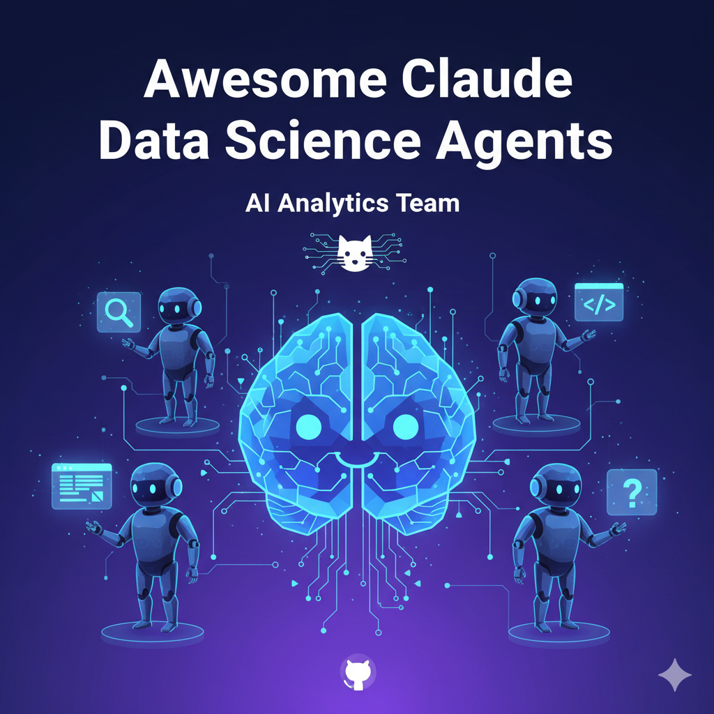

<p align="center">
  
</p>

# Awesome Claude 数据科学智能体团队 🚀

**使用专业的AI智能体团队增强Claude Code**，专门用于数据分析、机器学习、可视化和数据科学工作流程。

[](README.md)
[](README_CN.md)

## ⚠️ 重要说明

**本项目处于实验阶段且消耗大量token。** 数据科学智能体专为复杂的分析工作流程设计，在数据探索和建模阶段可能会消耗大量token。

## 🚀 快速开始（3分钟）

### 前置条件
- **Claude Code CLI** 已安装并验证
- **Claude订阅** - 强制性的分析工作流程要求
- 活跃的项目目录包含您的数据
- **Python环境（3.8+）** 配备必要的数据科学库

**快速设置**：
```bash
# 选项1：使用pip安装
pip install pandas numpy matplotlib seaborn scikit-learn plotly jupyter

# 选项2：使用我们完整的requirements.txt
pip install -r examples/requirements.txt

# 选项3：使用conda环境
conda env create -f examples/environment.yml
conda activate data-science-agents
```

### 1. 安装智能体
```bash
git clone https://github.com/StanleyChanH/awesome-claude-data-agents.git
```

#### 选项A：符号链接（推荐 - 自动更新）

**macOS/Linux:**
```bash
# 如果agents目录不存在则创建
mkdir -p ~/.claude/agents

# 创建数据科学智能体集合的符号链接
ln -sf "$(pwd)/awesome-claude-data-agents/agents/" ~/.claude/agents/awesome-claude-data-agents
```

**Windows (PowerShell):**
```powershell
# 创建agents目录
New-Item -Path "$env:USERPROFILE\.claude\agents" -ItemType Directory -Force

# 创建符号链接
cmd /c mklink /D "$env:USERPROFILE\.claude\agents\awesome-claude-data-agents" "$(Get-Location)\awesome-claude-data-agents\agents"
```

#### 选项B：复制（静态 - 无自动更新）
```bash
# 如果agents目录不存在则创建
mkdir -p ~/.claude/agents

# 复制所有智能体
cp -r awesome-claude-data-agents/agents ~/.claude/agents/awesome-claude-data-agents
```

### 2. 验证安装
```bash
claude /agents
# 应该显示所有数据科学智能体。
```

### 3. 初始化您的数据项目
**导航**到您的**项目目录**并运行：

```bash
claude "使用@data-team-configurator分析我的项目以设置最佳的数据科学团队。"
```

### 4. 开始分析
```bash
claude "使用@data-science-orchestrator分析此数据集以构建预测模型"
```

您的AI数据科学团队将自动检测您的数据并使用合适的专家！

## 🎯 自动配置工作原理

@data-team-configurator自动为您设置最佳的AI数据科学团队。调用时，它会：

1. **定位项目结构** - 查找现有配置并保留您的自定义内容
2. **检测数据环境** - 检查requirements.txt、pyproject.toml、数据文件和notebook
3. **发现可用智能体** - 扫描数据科学专业智能体
4. **选择专家** - 优先选择领域特定智能体而非通用智能体
5. **更新配置** - 创建最佳智能体映射
6. **提供使用指导** - 显示检测到的数据类型和示例命令

## 👥 认识您的AI数据科学团队

### 🎭 协调器（3个智能体）
- **[数据科学协调器](agents/orchestrators/data-science-orchestrator.md)** - 协调复杂分析项目和多步骤工作流程的高级数据科学家
- **[数据分析师](agents/orchestrators/data-analyst.md)** - 数据探索和统计分析专家
- **[团队配置器](agents/orchestrators/data-team-configurator.md)** - 数据科学项目设置专家

### 📊 数据分析专家（6个智能体）
- **[统计分析师](agents/analysis/statistical-analyst.md)** - 统计测试、假设检验和实验设计
- **[数据清洗器](agents/analysis/data-cleaner.md)** - 数据预处理、缺失值和数据质量
- **[特征工程师](agents/analysis/feature-engineer.md)** - 特征选择、创建和转换
- **[时间序列分析师](agents/analysis/time-series-analyst.md)** - 时间序列分析、预测和时序模式
- **[数据探索者](agents/analysis/data-explorer.md)** - 探索性数据分析和模式发现
- **[SQL分析师](agents/analysis/sql-analyst.md)** - 数据库查询和数据提取优化

### 🤖 机器学习专家（2个智能体）
- **[ML工程师](agents/ml/ml-engineer.md)** - 端到端机器学习管道开发（包含超参数调优）
- **[模型验证器](agents/ml/model-validator.md)** - 模型评估、交叉验证和性能指标

*未来ML智能体：深度学习、NLP、计算机视觉、集成方法、MLOps*

### 📈 可视化专家（1个智能体）
- **[数据可视化器](agents/visualization/data-visualizer.md)** - 通用数据可视化和图表创建（包含报告和仪表板）

*未来可视化智能体：交互式仪表板、统计图表、报告设计*

### 🔧 核心团队（1个智能体）
- **[代码审查者（数据科学）](agents/core/data-science-code-reviewer.md)** - 数据科学代码质量和最佳实践

*未来核心智能体：数据考古学家、文档专家*

**总计：13个专业数据科学智能体** 协同工作分析您的数据！

*注意：这是包含核心智能体的初始版本。额外的专业智能体（深度学习、NLP、计算机视觉等）将在未来版本中添加。*

## 🔥 为什么数据科学团队胜过单一AI

- **领域专长**：每个智能体掌握特定的Python库和分析技术
- **方法论方法**：智能体遵循Python数据科学最佳实践和统计原理
- **全面分析**：多个专家覆盖Python数据科学生命周期的所有方面
- **质量保证**：内置验证和审查流程确保健壮、可重现的Python代码

## 📈 影响

- **更深入的洞察** - 发现您可能错过的模式和关系
- **稳健的模型** - 构建性能可靠的机器学习模型
- **更快的分析** - 在几分钟内完成分析工作流程，而不是几天
- **更好的决策** - 自信地做出数据驱动的决策

## 📚 了解更多

- [创建自定义数据科学智能体](docs/creating-agents.md) - 为您的分析需求构建专家
- [数据科学最佳实践](docs/best-practices.md) - 从您的AI数据团队获得最大价值
- [智能体关系和协调](docs/agent-relationships.md) - 理解智能体协调
- [客户流失分析示例](examples/customer-churn-analysis.md) - 完整的Python工作流示例
- [Python环境设置](examples/requirements.txt) - 完整的Python依赖
- [Conda环境](examples/environment.yml) - 替代conda设置

## 💬 加入社区

- ⭐ **为这个仓库点赞** 以示支持
- 🐛 [报告问题](https://github.com/StanleyChanH/awesome-claude-data-agents/issues)
- 💡 [分享想法](https://github.com/StanleyChanH/awesome-claude-data-agents/discussions)
- 🎉 [成功故事](https://github.com/StanleyChanH/awesome-claude-data-agents/discussions/categories/show-and-tell)

## 📄 许可证

MIT许可证 - 在您的项目中自由使用！

## Star History

[](https://star-history.dev/#StanleyChanH/awesome-claude-data-agents&Date)

---

<p align="center">
  <strong>将Claude Code转换为提供分析洞察的AI数据科学团队</strong><br>
  <em>专业专长。全面分析。可操作的洞察。</em>
</p>

<p align="center">
  <a href="https://github.com/StanleyChanH/awesome-claude-data-agents">GitHub</a> •
  <a href="docs/creating-agents.md">文档</a> •
  <a href="https://github.com/StanleyChanH/awesome-claude-data-agents/discussions">社区</a>
</p>